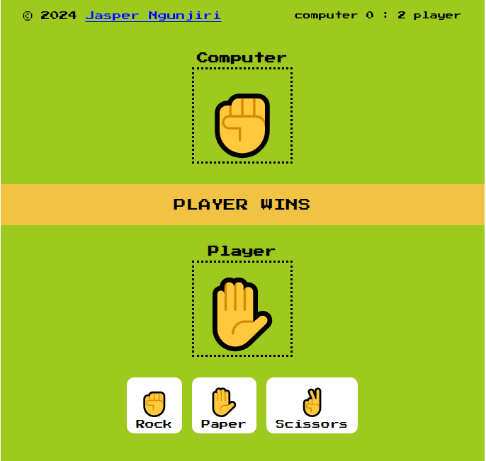

# An interactive Rock, Paper, Scissors game

 
 In this game, the player competes against the computer.
 This is a classic hand game that is both fun and simple to play. The objective of the game is to select an option *(Rock, Paper, or Scissors)* and compare it with the computer's random choice to determine the winner based on the established rules which are as follows:

- Rock wins against Scissors.

- Scissors wins against paper.

- Paper wins against Rock.

## Have fun playing it. 😉